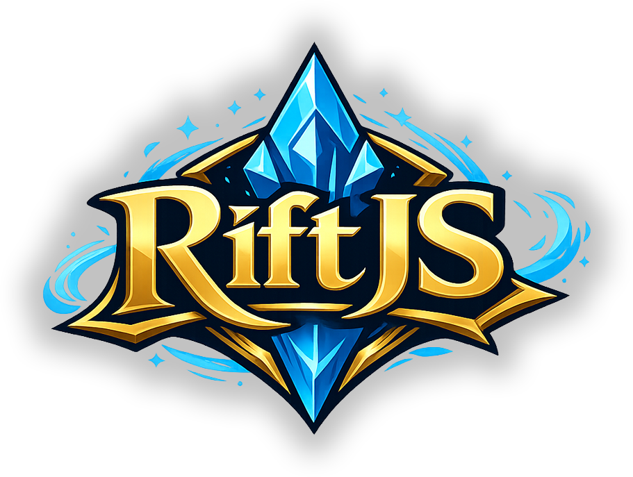

TypeScript-first Riot Games API wrapper for Node.js, with built-in Data Dragon support.

[](https://www.npmjs.com/package/@timmsy/riftjs)


## What this package does

RiftJS wraps common Riot API and Data Dragon use cases in a small API:

- Resolve account details from Riot ID
- Get summoner details from PUUID
- Get rank entries and queue-split rank summaries
- Get match IDs, match details, and match timelines
- Fetch all match IDs with paging and optional pacing
- Fetch Data Dragon champion and item static data

The package is authored in TypeScript and published as compiled CommonJS with `.d.ts` types.

## Install

```bash
npm install @timmsy/riftjs
```

You need a Riot developer key:
- https://developer.riotgames.com/

## Quick Start

### 1. Configure environment

Create a `.env` file in your app:

```env
RIOT_API_KEY=RGAPI-your-key-here
REGION=EUW1
```

Notes:
- `RIOT_API_KEY` is required for `RiotAPI`.
- `REGION` is optional. Default is `EUW1`.

### 2. Basic usage (JavaScript / CommonJS)

```js
const { RiotAPI, DataDragon } = require('@timmsy/riftjs');

async function main() {
  const riot = new RiotAPI();
  const account = await riot.getAccountByRiotId('PlayerName#EUW');
  const summoner = await riot.getSummonerByPuuid(account.puuid);
  const matchIds = await riot.getMatchlistByPuuid(account.puuid, { start: 0, count: 5 });

  console.log('Summoner level:', summoner.summonerLevel);
  console.log('Recent matches:', matchIds);

  const dd = new DataDragon();
  const champions = await dd.getChampions();
  console.log('Champion count:', Object.keys(champions.data || {}).length);
}

main().catch((err) => {
  console.error(err.message);
  process.exitCode = 1;
});
```

### 3. Basic usage (TypeScript)

```ts
import { RiotAPI, DataDragon } from '@timmsy/riftjs';

async function main(): Promise<void> {
  const riot = new RiotAPI();
  const account = await riot.getAccountByRiotId('PlayerName#EUW');
  const rank = await riot.getRankByPuuid(String(account.puuid || ''));

  console.log('Solo queue:', rank.solo);
  console.log('Flex queue:', rank.flex);

  const dd = new DataDragon();
  const items = await dd.getItems();
  console.log('Item count:', Object.keys((items.data as Record<string, unknown>) || {}).length);
}

main().catch((err: unknown) => {
  const message = err instanceof Error ? err.message : 'Unknown error';
  console.error(message);
  process.exitCode = 1;
});
```

## API Reference

## RiotAPI

`new RiotAPI()` reads:
- `RIOT_API_KEY` from environment
- `REGION` from environment (default `EUW1`)

### getAccountByRiotId(riotId, tagLine?, region?)

- Input:
  - `riotId: string` (`"Name#Tag"` format, or name-only with `tagLine`)
  - `tagLine?: string | null`
  - `region?: RegionCode`
- Output: account payload (includes `puuid`)
- Example:
```ts
const account = await riot.getAccountByRiotId('Timmsy#BRUV');
```

### getSummonerByPuuid(puuid, region?)

- Input:
  - `puuid: string`
  - `region?: RegionCode`
- Output: Summoner V4 payload

### getRankEntriesByPuuid(puuid, region?)

- Input:
  - `puuid: string`
  - `region?: RegionCode`
- Output: League V4 rank entries array

### getRankByPuuid(puuid, region?)

- Input:
  - `puuid: string`
  - `region?: RegionCode`
- Output:
  - `solo`: solo queue entry with computed `winRate` (or `null`)
  - `flex`: flex queue entry with computed `winRate` (or `null`)
  - `entries`: original rank entries

Queue constants used internally:
- `RANKED_SOLO_5x5`
- `RANKED_FLEX_SR`

### getMatchlistByPuuid(puuid, options?, region?)

- Input:
  - `puuid: string`
  - `options?: MatchlistOptions`
  - `region?: RegionCode`
- Output: `string[]` of match IDs

`MatchlistOptions`:
- `startTime?: number` (epoch seconds)
- `endTime?: number` (epoch seconds)
- `queue?: number`
- `type?: string`
- `start?: number`
- `count?: number` (Riot max is 100 for this endpoint)

### getMatchById(matchId, region?)

- Input:
  - `matchId: string` (example `EUW1_1234567890`)
  - `region?: RegionCode`
- Output: Match V5 payload (`metadata` + `info`)

### getMatchTimelineById(matchId, region?)

- Input:
  - `matchId: string`
  - `region?: RegionCode`
- Output: Match timeline payload

### getMatchlistByPuuidAll(puuid, options?, region?, pacing?)

- Purpose: fetches all match IDs in pages of up to 100.
- Input:
  - `puuid: string`
  - `options?: MatchlistOptions` (filters + optional start offset)
  - `region?: RegionCode`
  - `pacing?: { delayMs?: number; maxMatches?: number | null }`
- Output: `string[]` of aggregated match IDs

### getMatchesWithDetailsByPuuid(puuid, options?, region?, pacing?)

- Purpose: fetches match IDs, then fetches each match payload.
- Input:
  - `puuid: string`
  - `options?: MatchlistOptions`
  - `region?: RegionCode`
  - `pacing?: { pageDelayMs?: number; detailDelayMs?: number; maxMatches?: number | null }`
- Output:
  - `matchIds: string[]`
  - `matches: object[]`

## DataDragon

### new DataDragon(version?, locale?)

- `version?: string | null`
  - Omit to auto-resolve the latest Data Dragon version
  - Pass a version like `15.4.1` to pin
- `locale?: string`
  - Defaults to `en_US`

### getChampions()

- Output: Data Dragon champion payload (`champion.json`)

### getItems()

- Output: Data Dragon item payload (`item.json`)

## Supported regions

Supported `REGION` / `region` values:

`BR1`, `EUN1`, `EUW1`, `JP1`, `KR`, `LA1`, `LA2`, `NA1`, `OC1`, `TR1`, `RU`, `PH2`, `SG2`, `TH2`, `TW2`, `VN2`

Routing behavior:
- Platform APIs (example Summoner V4) use platform hosts like `euw1.api.riotgames.com`.
- Regional APIs (example Match V5 / Account V1) use shard hosts like `europe.api.riotgames.com`.

## Error behavior

RiftJS normalizes errors to plain `Error` objects with readable messages:

- HTTP response errors: `API error <status>: <message>`
- No response from Riot: `No response received from the server`
- Request setup/other errors: `Request error: <message>`
- Data Dragon wrapper errors: `DataDragon error: <message>`

## Local development

### Run locally

```bash
git clone https://github.com/timmsy1998/RiftJS.git
cd RiftJS
npm install
npm run build
```

### Run endpoint checks

```bash
npm test
```

Test script behavior:
- Riot endpoint checks run only when `RIOT_API_KEY` and `TEST_RIOT_ID` are set.
- Data Dragon checks always run.

Optional `.env` values for tests:

```env
TEST_RIOT_ID=YourRiotName
TEST_TAG_LINE=EUW
```

Maintainer notes:
- See `MAINTAINER_NOTES.md` for project conventions and release checklist.

## Package output

Published entry points:
- `main`: `dist/index.js`
- `types`: `dist/index.d.ts`

Build command:

```bash
npm run build
```

Compiled output is written to `dist/`.

## License

MIT License © 2025 James Timms. See [LICENSE](LICENSE).

## Links

- npm: https://www.npmjs.com/package/@timmsy/riftjs
- GitHub: https://github.com/timmsy1998/RiftJS
- Riot Developer Portal: https://developer.riotgames.com/
